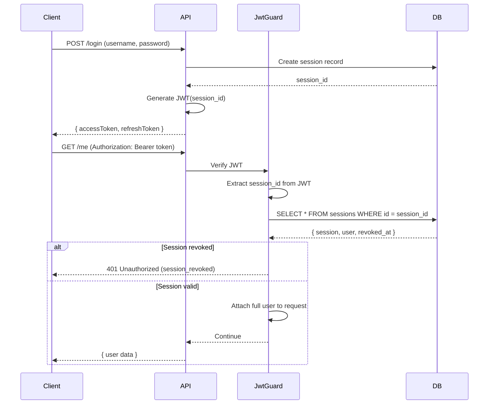

# Session-Based JWT Security Implementation

## Overview

Laniakea SSO menggunakan **session-based JWT strategy** untuk keamanan maksimal. JWT hanya berisi `session_id` sebagai reference token, bukan data user lengkap.

## Problem dengan JWT Tradisional

JWT tradisional menyimpan data user di payload:

```json
{
  "sub": "user-id",
  "email": "user@example.com",
  "username": "johndoe",
  "tenantId": "tenant-id",
  "iat": 1699876543,
  "exp": 1699880143
}
```

**Masalah:**

- ❌ Data user exposed di client (decode JWT bisa lihat semua data)
- ❌ Tidak bisa instant revocation (harus tunggu token expire)
- ❌ Update user data = harus regenerate token baru
- ❌ Sulit tracking device/session yang aktif

## Session-Based JWT Solution

### JWT Payload (New)

```json
{
  "session_id": "550e8400-e29b-41d4-a716-446655440001",
  "type": "access",
  "iat": 1699876543,
  "exp": 1699880143
}
```

JWT hanya berisi **session_id** sebagai reference ke database.

### Authentication Flow



## Implementation Details

### 1. Login (auth.service.ts)

```typescript
async login(loginDto: LoginDto, request: FastifyRequest) {
  // ... authentication logic ...

  // Create session
  const sessionId = uuidv4();
  await this.prisma.session.create({
    data: {
      id: sessionId,
      userId: user.id,
      ipAddress,
      userAgent,
      deviceName,
      // ...
    },
  });

  // Generate JWT with only session_id
  const accessToken = await this.generateAccessToken(sessionId);

  return { accessToken, refreshToken, user };
}
```

### 2. Generate Access Token

```typescript
private async generateAccessToken(sessionId: string): Promise<string> {
  const payload = {
    session_id: sessionId,  // ✅ Only session_id
    type: 'access',
  };

  return this.jwtService.sign(payload, {
    secret: this.configService.get('JWT_SECRET'),
    expiresIn: '1h',
  });
}
```

### 3. JWT Auth Guard (jwt-auth.guard.ts)

```typescript
async canActivate(context: ExecutionContext): Promise<boolean> {
  const request = context.switchToHttp().getRequest<FastifyRequest>();
  const token = this.extractTokenFromHeader(request);

  // Verify JWT
  const payload = await this.jwtService.verifyAsync(token, {
    secret: this.configService.get<string>('JWT_SECRET'),
  });

  // Extract session_id
  const sessionId = payload.session_id;

  // ✅ Fetch session from database
  const session = await this.prisma.session.findUnique({
    where: { id: sessionId },
    include: { user: true },
  });

  if (!session) {
    throw new UnauthorizedException({
      message: 'Session not found',
      reason: 'session_not_found',
    });
  }

  // ✅ Check if session revoked
  if (session.revokedAt) {
    throw new UnauthorizedException({
      message: 'Session has been revoked. Please login again.',
      reason: 'session_revoked',
    });
  }

  // ✅ Attach full user data (from DB, not JWT)
  (request as any).user = {
    id: session.user.id,
    name: session.user.name,
    username: session.user.username,
    email: session.user.email,
    // ... other fields
    sessionId: session.id,
  };

  return true;
}
```

## Database Schema

### Sessions Table

```sql
CREATE TABLE `sessions` (
  `id` char(36) NOT NULL,
  `user_id` char(36) NOT NULL,
  `ip_address` varchar(45) DEFAULT NULL,
  `user_agent` varchar(255) DEFAULT NULL,
  `device_name` varchar(100) DEFAULT NULL,
  `latitude` varchar(50) DEFAULT NULL,
  `longitude` varchar(50) DEFAULT NULL,
  `payload` longtext,
  `last_activity` timestamp NOT NULL DEFAULT CURRENT_TIMESTAMP,
  `revoked_at` timestamp NULL DEFAULT NULL,  -- ✅ For instant revocation
  `created_at` timestamp NOT NULL DEFAULT CURRENT_TIMESTAMP,
  `updated_at` timestamp NOT NULL DEFAULT CURRENT_TIMESTAMP ON UPDATE CURRENT_TIMESTAMP,
  PRIMARY KEY (`id`)
) ENGINE=InnoDB;
```

## Device Management

### 1. List Active Sessions

```http
GET /api/v1/auth/sessions
Authorization: Bearer <token>
```

**Response:**

```json
{
  "message": "Active sessions retrieved successfully",
  "sessions": [
    {
      "id": "session-1",
      "deviceName": "Chrome on Windows",
      "ipAddress": "192.168.1.100",
      "lastActivity": "2025-11-12T14:30:00Z",
      "isCurrent": true
    },
    {
      "id": "session-2",
      "deviceName": "Safari on iPhone",
      "ipAddress": "10.0.0.5",
      "lastActivity": "2025-11-11T10:15:00Z",
      "isCurrent": false
    }
  ]
}
```

### 2. Revoke Session (Force Logout)

```http
DELETE /api/v1/auth/sessions/session-2
Authorization: Bearer <token>
```

**What happens:**

1. `sessions.revoked_at` set to NOW()
2. All `refresh_tokens` for that session revoked
3. Next API call with that session's JWT → `401 Unauthorized (session_revoked)`

## Benefits

### ✅ Security

- JWT tidak expose data user (hanya session_id UUID)
- Session bisa di-revoke instant tanpa tunggu token expire
- Deteksi suspicious activity lebih mudah (track per session)

### ✅ Device Management

- User bisa lihat semua device yang login
- Revoke access dari device tertentu (lost phone, dll)
- Track IP, location, last activity per device

### ✅ Flexibility

- Update user data (email, name, dll) tidak perlu regenerate JWT
- Tenant switching tidak perlu issue token baru
- Session timeout bisa dikontrol dari database

### ✅ Audit & Compliance

- Semua session tercatat di `sessions` table
- Audit log untuk setiap session revocation
- Compliance: Track siapa login dari mana, kapan, device apa

## Frontend Integration

### Auto-Refresh dengan Session Check

```typescript
// axios interceptor
axios.interceptors.response.use(
  (response) => response,
  async (error) => {
    if (error.response?.status === 401) {
      const reason = error.response?.data?.error?.reason;

      // ✅ Check if session revoked
      if (reason === 'session_revoked') {
        // Force logout, clear tokens
        localStorage.removeItem('accessToken');
        localStorage.removeItem('refreshToken');
        window.location.href = '/login?reason=session_revoked';
        return;
      }

      // Try refresh token
      // ...
    }
    return Promise.reject(error);
  },
);
```

### Device Management UI

```typescript
// Fetch active sessions
const { data } = await axios.get('/api/v1/auth/sessions');

// Display sessions
sessions.map(session => (
  <div>
    <h3>{session.deviceName}</h3>
    <p>{session.ipAddress} - {session.lastActivity}</p>
    {session.isCurrent ? (
      <span>Current Device</span>
    ) : (
      <button onClick={() => revokeSession(session.id)}>
        Revoke
      </button>
    )}
  </div>
));

// Revoke session
const revokeSession = async (sessionId) => {
  await axios.delete(`/api/v1/auth/sessions/${sessionId}`);
  alert('Device logged out successfully');
};
```

## Migration from Traditional JWT

### Before (Traditional JWT)

```typescript
// JWT payload
{
  "sub": "user-id",
  "email": "user@example.com",
  "username": "johndoe",
  "tenantId": "tenant-id"
}

// Guard
request.user = payload; // Direct from JWT
```

### After (Session-Based JWT)

```typescript
// JWT payload
{
  "session_id": "uuid-here",
  "type": "access"
}

// Guard
const session = await prisma.session.findUnique({
  where: { id: payload.session_id },
  include: { user: true }
});
request.user = session.user; // From database
```

## Performance Considerations

### Query Optimization

- Index pada `sessions.id` (PRIMARY KEY)
- Index pada `sessions.user_id` untuk query by user
- Index pada `sessions.revoked_at` untuk filter active sessions

### Caching (Future Enhancement)

```typescript
// Redis cache untuk session data
const cachedSession = await redis.get(`session:${sessionId}`);
if (cachedSession) {
  return JSON.parse(cachedSession);
}

const session = await prisma.session.findUnique(...);
await redis.setex(`session:${sessionId}`, 3600, JSON.stringify(session));
```

## Security Best Practices

1. **Session Timeout**: Auto-revoke sessions inactive > 30 days
2. **Max Sessions**: Limit max concurrent sessions per user (e.g., 5 devices)
3. **Suspicious Activity**: Auto-revoke sessions with unusual IP/location
4. **Password Change**: Revoke all sessions when password changed
5. **Admin Action**: Owner can revoke all sessions for locked user

## Error Handling

### Error Reasons

| Reason              | Description                      | Action                      |
| ------------------- | -------------------------------- | --------------------------- |
| `session_not_found` | Session ID tidak ada di database | Force logout                |
| `session_revoked`   | Session sudah di-revoke          | Force logout, show message  |
| `invalid_token`     | JWT invalid/expired              | Try refresh, or logout      |
| `account_locked`    | User account locked              | Show error, contact support |
| `temporary_lock`    | Account temporary locked         | Show countdown, retry       |

### Frontend Error Handling

```typescript
switch (error.reason) {
  case 'session_revoked':
    showNotification('Your session was revoked. Please login again.');
    forceLogout();
    break;

  case 'session_not_found':
    showNotification('Invalid session. Please login again.');
    forceLogout();
    break;

  case 'account_locked':
    showNotification('Account locked. Contact support.');
    redirectToSupport();
    break;
}
```

## Testing

### Test Session Revocation

```bash
# Login
POST /api/v1/auth/login
Response: { accessToken, sessionId }

# Get sessions
GET /api/v1/auth/sessions
Response: [{ id: sessionId, ... }]

# Revoke session
DELETE /api/v1/auth/sessions/:sessionId
Response: { message: "Session revoked successfully" }

# Try to use revoked token
GET /api/v1/auth/me
Response: 401 Unauthorized { reason: "session_revoked" }
```

## Summary

Session-based JWT memberikan:

- ✅ **Security**: Data tidak exposed di JWT
- ✅ **Control**: Instant session revocation
- ✅ **Visibility**: Device management & tracking
- ✅ **Flexibility**: Update user tanpa regenerate token
- ✅ **Audit**: Complete session history

Implementasi ini mengikuti best practices untuk modern authentication systems.

---

© 2025 Laniakea SSO - Session-Based JWT Security
